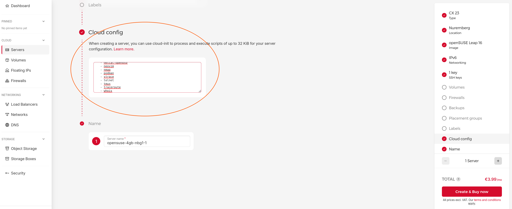
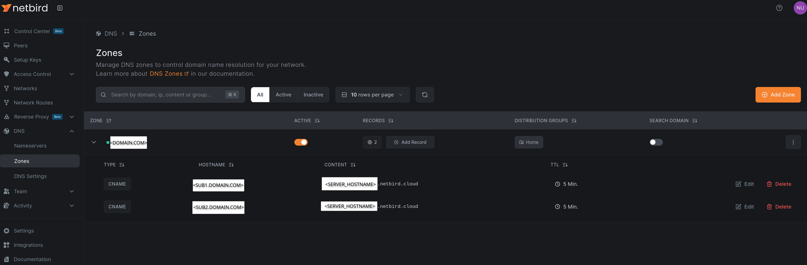

# Personal Locker on Hetzner

A self-hosted private service stack on a Hetzner VPS, accessible only through a Netbird VPN tunnel. No ports are exposed to the public internet.

**Stack:** Netbird (VPN), Caddy (reverse proxy + internal TLS), Vaultwarden (password manager), dufs (file server)

## Architecture

```
  Client (PC / Laptop)
          │
          │  DNS: sub.domain.com → server.netbird.cloud → 100.115.x.x
          │       (resolved via Netbird DNS zone)
          │
          │  HTTPS via Netbird VPN tunnel (wt0)
          │
┌─────────▼──────────── Hetzner Server -------──────────────────────┐
│  firewalld: drop-all, allow 100.115.0.0/16 on 80/443              │
│                                                                   │
│  Netbird daemon  (host process — owns wt0 interface)              │
│          │                                                        │
│  ┌───────▼──────────── Podman Pod: locker ----────────────────┐   │
│  │                                                            │   │
│  │  ┌──────────────────┐    vault.domain.com                  │   │
│  │  │  Caddy :80/:443  │ ──────────────────► Vaultwarden:8081 │   │
│  │  │  (tls internal)  │    file.domain.com                   │   │
│  │  └──────────────────┘ ──────────────────► dufs:5000        │   │
│  │                                                            │   │          
│  └────────────────────────────────────────────────────────----┘   │
└──────────────────────────────────────────────────────────────-----┘
```

Netbird runs on the **host**, not in a container — running it inside a container confines the `wt0` interface to the container's network namespace, making the VPN route invisible to the host kernel.

Caddy uses `tls internal` (its own CA) instead of ACME. The CA cert (`caddy-root.crt`) must be trusted on each client machine and browser.

## Prerequisites

- **Podman** installed on the server (rootless)
- **Netbird account** — needed to generate a `SETUP_KEY` for peer registration and to configure the DNS zone

## Setup the Server on Hetzner

### Create the Server on Hetzner

1. Copy the cloud-init template and fill in the two placeholders: `<YOUR_USER>` (the non-root user to create) and `<YOUR_SSH_PUB_KEY>` (your `~/.ssh/id_rsa.pub` content).

```console
$ cp templates/leap16-cloudinit-example.yaml cloudinit.yaml
```

2. Provision a new VPS on Hetzner using the edited `cloudinit.yaml` as the user data.



### Setup private connect with Netbird

1. Install Netbird on the host (not in a container — see [Architecture](#architecture)).

```console
server$ sudo zypper addrepo https://pkgs.netbird.io/yum/ netbird
server$ sudo zypper in netbird
```

[openSUSE netbird install - official site](https://docs.netbird.io/get-started/install/linux#open-suse-zypper)

2. Enable and connect using your server setup key.

```console
server$ sudo systemctl enable --now netbird
server$ sudo netbird up --setup-key <SETUP_KEY_FOR_SERVER>
Connected
```

[Register machine using setup keys - official site](https://docs.netbird.io/manage/peers/register-machines-using-setup-keys#related-video-content)

3. Confirm the `wt0` interface is up and the route is present.

```console
server$ ip addr show wt0
3: wt0: <POINTOPOINT,NOARP,UP,LOWER_UP> mtu 1280 qdisc noqueue state UNKNOWN group default qlen 1000
    link/none 
    inet <ADDR>/16 brd <NETMASK> scope global wt0
       valid_lft forever preferred_lft forever

server$ ip route show dev wt0
<ADDR>/16 proto kernel scope link src <ADDR>
```

4. Open the Netbird [Peers Dashboard](https://app.netbird.io/peers) and verify the server peer was registered automatically.

5. Configure `firewalld`: set the default zone to `drop`, create a custom zone, and open UDP 51820 (Netbird WireGuard port).

```console
server$ sudo firewall-cmd --list-all
public (default, active)
  target: default
  ingress-priority: 0
  egress-priority: 0
  icmp-block-inversion: no
  interfaces: eth0
  sources: 
  services: dhcpv6-client ssh
  ports: 
  protocols: 
  forward: yes
  masquerade: no
  forward-ports: 
  source-ports: 
  icmp-blocks: 
  rich rules: 

server$ sudo firewall-cmd --set-default-zone=drop
success

server$ ZONE=myhome

server$ sudo firewall-cmd --permanent --new-zone="${ZONE}"
success

server$ sudo firewall-cmd --permanent --zone="${ZONE}" --add-port=51820/udp
success

server$ sudo firewall-cmd --reload
success

server$ sudo firewall-cmd --zone="${ZONE}" --list-all
myhome
  target: default
  ingress-priority: 0
  egress-priority: 0
  icmp-block-inversion: no
  interfaces: 
  sources: 
  services: 
  ports: 51820/udp
  protocols: 
  forward: no
  masquerade: no
  forward-ports: 
  source-ports: 
  icmp-blocks: 
  rich rules: 
```

## Test with SSH access from client

SSH is restricted to clients within the Netbird subnet. The client must be connected to Netbird before SSH will be reachable.

1. Install and start Netbird on the client machine — follow steps 1 and 2 from [Setup private connect with Netbird](#setup-private-connect-with-netbird).

2. On the server, add a firewall rule to allow SSH from the Netbird subnet.

```console
$ sudo firewall-cmd --permanent --zone="${ZONE}" --add-rich-rule='rule family="ipv4" source address="100.115.0.0/16" port port="22" protocol="tcp" accept'
success

$ sudo firewall-cmd --reload
success
```

3. Verify SSH access using the server's Netbird peer address.

```console
$ ssh <USER>@<SERVER_PEER_ADDR>
```

### Deploy the Locker service

1. Clone this repository on the server.

```console
server$ git clone https://github.com/nutthawit-l/poc-locker.git locker
```

2. Copy `.env.example` to `.env` and fill in all placeholder values.

3. Copy the Caddyfile template and replace `<SUB1.DOMAIN.COM>` and `<SUB2.DOMAIN.COM>` with your chosen subdomains (e.g., `vault.example.com` and `file.example.com`).

> **Reference**
>  - https://caddyserver.com/docs/caddyfile/directives/reverse_proxy
>  - https://caddyserver.com/docs/caddyfile/directives/header

4. Build the custom Caddy image (adds `dig` for troubleshooting).

```console
server$ make caddy-image
```

5. Embed the Caddyfile into a Kubernetes ConfigMap. Re-run this whenever the Caddyfile changes.

```console
server$ make caddy-file
```

6. Generate the Vaultwarden ConfigMap from `.env` values.

```console
server$ make warden-env
```

7. Copy the pod spec template, set the pod name, allow unprivileged binding on ports 80/443, then start the pod.

```console
server$ cp templates/server.yaml server.yaml
server$ yq e -i '(select(.kind == "Pod") | .metadata.name) = "locker"' server.yaml
server$ echo 'net.ipv4.ip_unprivileged_port_start=80' | sudo tee -a /etc/sysctl.conf
server$ sudo sysctl -p
server$ make server-up
```

8. Confirm Caddy has issued internal TLS certificates by checking the logs for the `enabling automatic TLS certificate management` message.

```console
podman logs locker-caddy 2>&1 | tail -20
{"level":"info","ts":1779150741.733714,"logger":"http","msg":"enabling automatic TLS certificate management","domains":["<SUB.DOMAIN.COM>","<SUB.DOMAIN.COM>","localhost"]}
```

### Access the service

1. In the Netbird dashboard, create a DNS zone for `<DOMAIN.COM>` and apply it to the *Home* distribution group (the group that includes your client machines). Then add a CNAME record for each `<SUB.DOMAIN.COM>` pointing to the server's Netbird hostname. Verify that DNS resolves through the VPN — the result should chain through `<SERVER_HOSTNAME>.netbird.cloud` to the server's peer address.



```console
dig +short <SUB.DOMAIN.COM>
<SERVER_HOSTNAME>.netbird.cloud.
<SERVER_PEER_ADDR>
```

2. Open ports 80 and 443 on the server firewall for the Netbird subnet, and allow ICMP (ping) so connectivity can be verified.

```console
server$ ZONE=myhome

server$ sudo firewall-cmd --permanent --zone="${ZONE}" --add-rich-rule='rule family="ipv4" source address="100.115.0.0/16" port port="80" protocol="tcp" accept'
success

server$ sudo firewall-cmd --permanent --zone="${ZONE}" --add-rich-rule='rule family="ipv4" source address="100.115.0.0/16" port port="443" protocol="tcp" accept'
success

server$ sudo firewall-cmd --permanent --zone="${ZONE}" --add-icmp-block-inversion
success

server$ sudo firewall-cmd --permanent --zone="${ZONE}" --remove-icmp-block=echo-request
Warning: NOT_ENABLED: echo-request
success

server$ sudo firewall-cmd --reload
success

server$ sudo firewall-cmd --zone="${ZONE}" --list-all
myhome
  target: default
  ingress-priority: 0
  egress-priority: 0
  icmp-block-inversion: no
  interfaces: 
  sources: 
  services: 
  ports: 51820/udp
  protocols: 
  forward: no
  masquerade: no
  forward-ports: 
  source-ports: 
  icmp-blocks: 
  rich rules: 
```

3. From the client, confirm DNS resolution and that ports 80 and 443 are reachable. Port 22 should be unreachable if the SSH rule was not added.

```console
$ domain=<SUB.DOMAIN.COM>
$ dig $domain +short
$ nc -zv $domain 80
$ nc -zv $domain 443
$ nc -zv $domain 22
```

### Trust the Caddy CA cert

1. Copy to your PC or Laptop

```console
scp tie@<SERVER_PEER_ADDR>:~/caddy-root.crt .
```

2. Trust it

```console
sudo cp caddy-root.crt /etc/pki/trust/anchors/caddy-root.crt
sudo update-ca-certificates
```

3. Test 

```console
curl -I https://<SUB1.DOMAIN.COM>
curl -I https://<SUB2.DOMAIN.COM>
```

### Trust on Browsers

**For Firefox:**

1. Go to `Settings` → `Privacy & Security` → scroll to `Certificates` → click `View Certificates`
2. Go to `Authorities` tab → click `Import`
3. Select the *caddy-root.crt* file you copied to your laptop
4. Check `Trust this CA to identify websites` → OK

**For Chrome/Chromium** — nothing extra needed after running the two commands, just restart the browser.

## Appendix

### Get Netbird SETUP_KEY

## Troubleshooting

### Failed to start pod

```console
starting container 28e70f7ceaef0e557b7ca03a38c4354b4c9a4ed3d10aee8b019abc6b7ab19ee1: rootlessport cannot expose privileged port 80, you can add 'net.ipv4.ip_unprivileged_port_start=80' to /etc/sysctl.conf (currently 1024), or choose a larger port number (>= 1024): listen tcp 0.0.0.0:80: bind: permission denied
```

This error happend because *Caddy* try to bind 80 and 443 ports to host but you have not yet allow to "**unprivileged** binding port start from 80"

**Temporary Fix (immediate, resets on reboot)**

```console
$ sudo sysctl -w net.ipv4.ip_unprivileged_port_start=80
$ sudo sysctl net.ipv4.ip_unprivileged_port_start
net.ipv4.ip_unprivileged_port_start = 80
```

**Persistent Fix (survives reboots)**

Add the setting to `/etc/sysctl.conf`:

```console
$ echo 'net.ipv4.ip_unprivileged_port_start=80' | sudo tee -a /etc/sysctl.conf
$ sudo sysctl -p
```

### API token '' appears invalid

```console
$ podman logs -f poc-locker-caddy
Error: loading initial config: loading new config: loading http app module: provision http: getting tls app: loading tls app module: provision tls: provisioning automation policy 0: loading TLS automation management module: position 0: loading module 'acme': provision tls.issuance.acme: loading DNS provider module: loading module 'cloudflare': provision dns.providers.cloudflare: API token '' appears invalid; ensure it's correctly entered and not wrapped in braces nor quotes
```

In this state Caddy isn't start propery, thus you can't shell to it's with `podman exec`, so if you want to check env inside container you must use:

```console
$ podman inspect poc-locker-caddy --format '{{.Config.Env}}'
```

### If you facing a Secret problem and want to delete use:

```console
distrobox-host-exec podman secret rm <YOUR_SECRET_NAME>
```

### Show container `env`

```console
distrobox-host-exec podman inspect <CONTAINER_NAME> --format '{{range .Config.Env}}{{println .}}{{end}}'
```

### Re-generate Netbird `SETUP_KEY` for the client

After add new key to `NB_SETUP_KEY_CLIENT` in *.env* file, run these command:

```console
distrobox-host-exec podman secret rm client-secret
make client-secret
distrobox-host-exec make client-down
distrobox-host-exec make client-up
```

### Remove any previously set sources from the zone 

```console
$ sudo firewall-cmd --permanent --zone="${ZONE}" --list-rich-rules

$ sudo firewall-cmd --permanent --zone="${ZONE}" --remove-rich-rule='<ONE_LINE_ABOVE_OUTPUT>'
```

### Run `podman` cli inside `distrobox` use:

```console
distrobox-host-exec make server-up
```

### Replace Caddyfile

What should I do after update Caddyfile.

1. Generate new ConfigMap

```console
make caddy-file
```

2. Replace the old one

```console
podman kube play --replace server.yaml --configmap caddyfile-cm.yaml --configmap vaultwarden-cm.yaml
```

3. Restart pod

```console
podman pod restart locker
```
